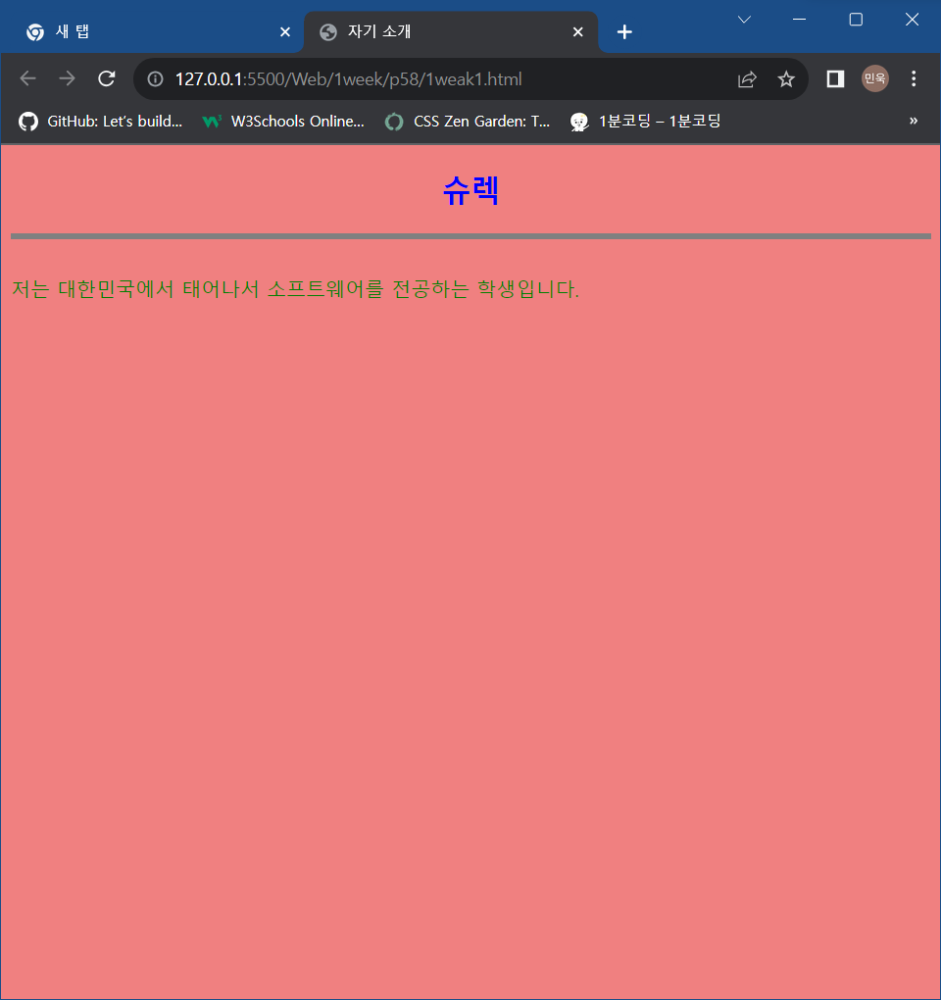
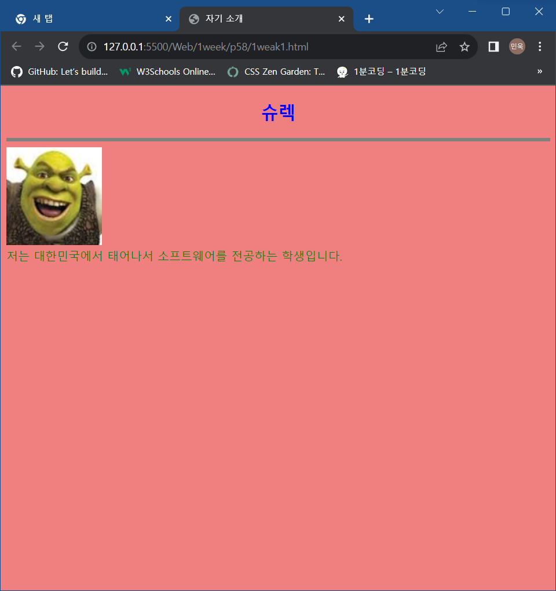
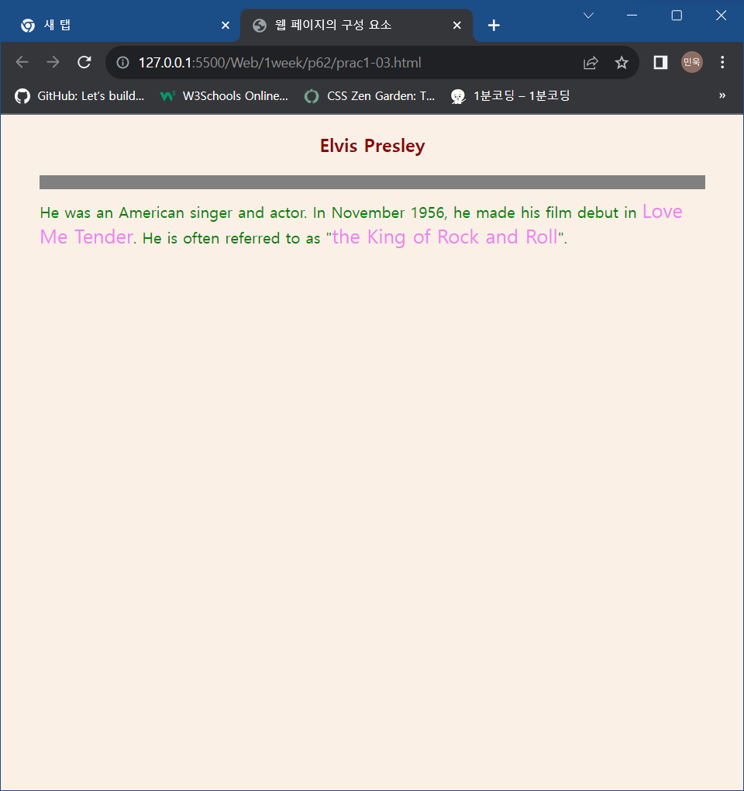
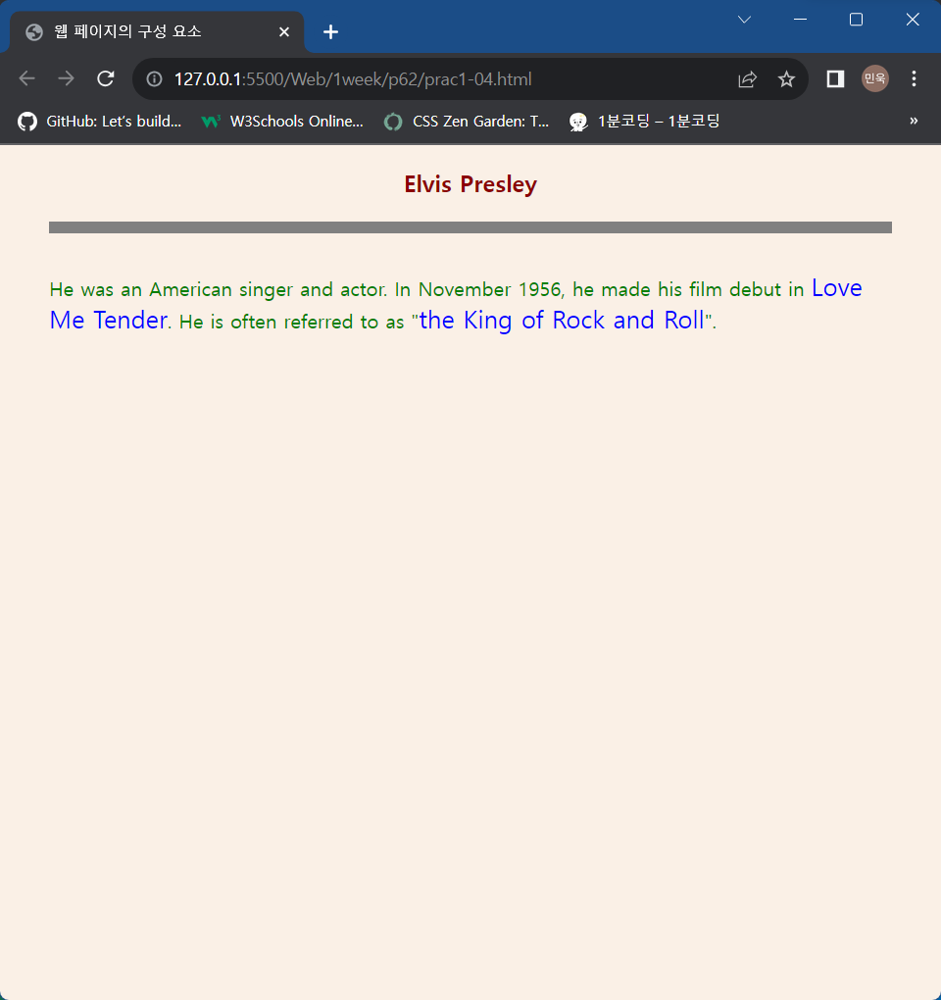
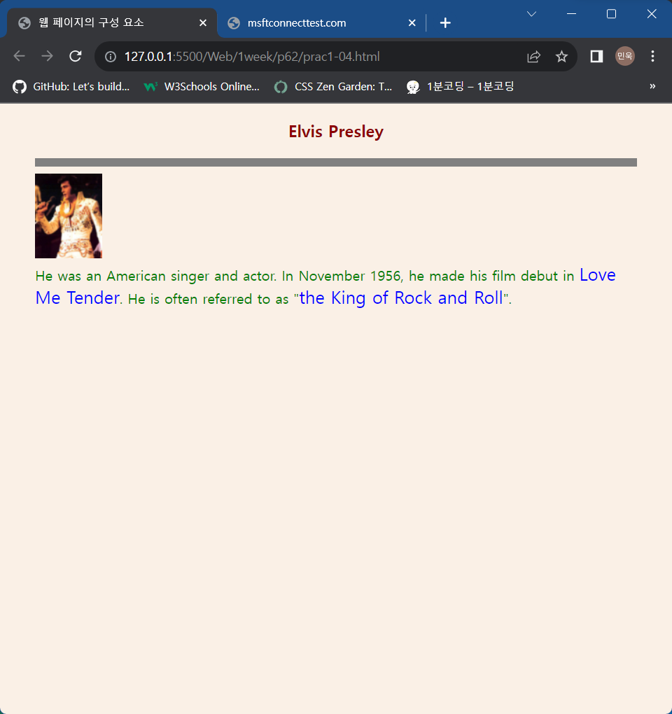
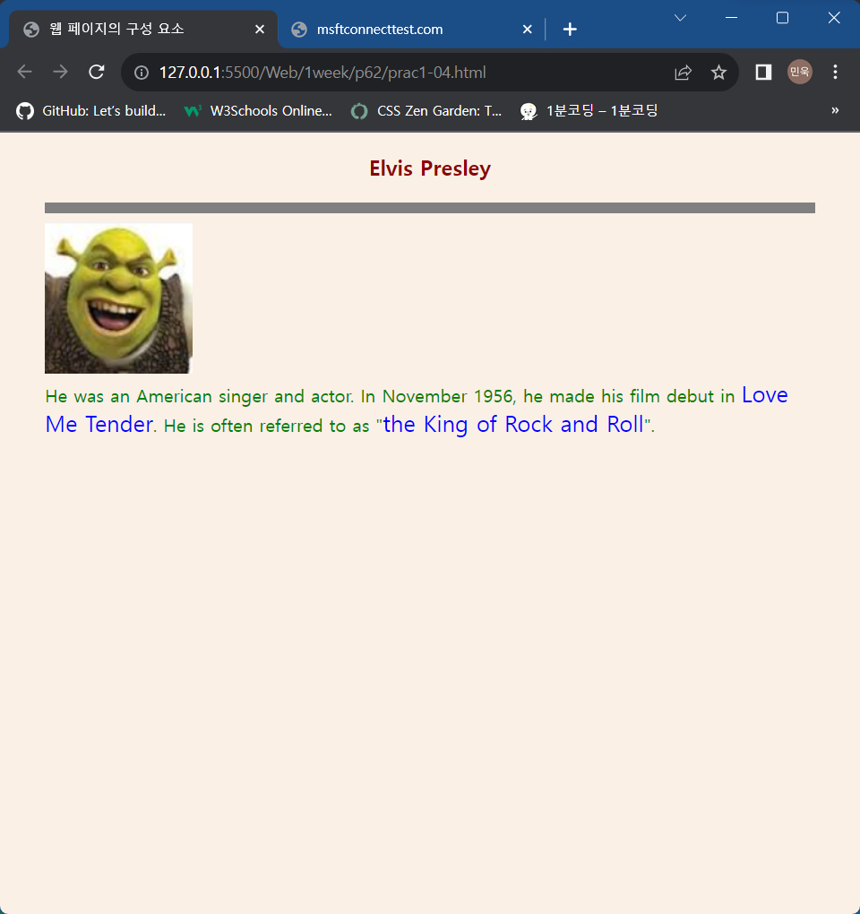

# 1week

# p58

## 1weak1.html



### 마우스를 올렸을 때



## code

```html
<!DOCTYPE html>
<html>
<head>
	<meta charset="UTF-8">
	<title>자기 소개</title>
	<style>
		body { 
			background-color : lightcoral;
			color : green;
		}
		h2 {
			text-align : center;
			color : blue;
		}
		hr {
			height : 5px;
			border : grey;
			background-color : grey;
		}
		span {
			color : darkred;
			font-size : 20px;
		}
	</style>
	<script>
		function OpenPicture() {
			document.getElementById("fig").src="shrek.png"
		}
		function HidePicture() {
			document.getElementById("fig").src="";
		}
	</script>
</head>
<body>
	<h2 onmouseover="OpenPicture()" onmouseout="HidePicture()">슈렉</h2>
	<hr>
	<div></div>
	저는 대한민국에서 태어나서 소프트웨어를 전공하는 학생입니다.
</body>
</html>
```

# p61

## prac1-01.html

```html
<!DOCTYPE html>
<html>
<head>
<meta charset="UTF-8">
<title>오류를 찾으세요</title>
<style>
	h3 { text-align : center; color : darkred; }
	span {color = blue; font-size : 20px; } <!--'span' 부분의 'color' 다음에 들어가야할 기호는 '='이 아닌 ':'이다.-->
</style>
</head>
<body>
<h3>Elvis Presley</h3>
He was an American singer and actor. In November 1956, 
he is often referred to as "<span>the King of Rock and Roll</span>".
</body>
</html>
```

## prac1-02.html

```html
<!DOCTYPE html>
<html>
<head>
<meta charset="UTF-8">
<title>오류를 찾으세요</title>
<style>
	h3 { text-align : center color : darkred; } <!--'h3' 안에 있는 'text-align : center' 뒤에 ';'이 빠져있다.-->
	span {color : blue; font-size : 20px; }
</style>
</head>
<body>
<h3>Elvis Presley</h3>
He was an American singer and actor. In November 1956, 
he is often referred to as "<span>the King of Rock and Roll</span>".
</body>
</html>
```

# p62

## prac1-03.html



### code

```html
<!DOCTYPE html>
<html>
<head>
<meta charset="UTF-8">
<title>웹 페이지의 구성 요소</title>
<style>
	body { background-color : linen; color : green;
			margin-left : 40px; margin-right : 40px;}
	h3 {text-align : center; color : darkred;}
	hr {height : 10px; border:solid grey; 
			background-color : grey; }
	span {color : violet; font-size : 20px; }
</style>
</head>
<body>
<h3>Elvis Presley</h3>
<hr>
He was an American singer and actor. In November 1956, 
he made his film debut in <span>Love Me Tender</span>.
He is often referred to as "<span>the King of Rock and Roll</span>".
</body>
</html>
```

## prac1-04.html



### h3에 마우스 올렸을 때



### Love Me Tender에 마우스를 올렸을 때



### code

```html
<!DOCTYPE html>
<html>
<head>
<meta charset="UTF-8">
<title>웹 페이지의 구성 요소</title>
<style>
	body { background-color : linen; color : green;
				margin-left : 40px; margin-right : 40px;}
	h3 { text-align : center; color : darkred;}
	hr { height : 5px; border : solid grey;
				background-color : grey }
	span { color: blue; font-size: 20px; }
</style>
<script>
	function show() {
		document.getElementById("fig").src = "ElvisPresley.png"
	}
	function hide() {
		document.getElementById("fig").src= "";
	}
    function show2() {
		document.getElementById("fig").src = "shrek.png"
	}
</script>
</head>
<body>
<h3 onmouseover="show()" onmouseout="hide()">Elvis Presley</h3>
<hr>
<div></div>
He was an American singer and actor. In November 1956,
he made his film debut in <span onmouseover="show2()" onmouseout="hide()">Love Me Tender</span>.
He is often referred to as "<span>the King of Rock and Roll</span>".
</body>
</html>
```