# 2week

# p104

## 2.html

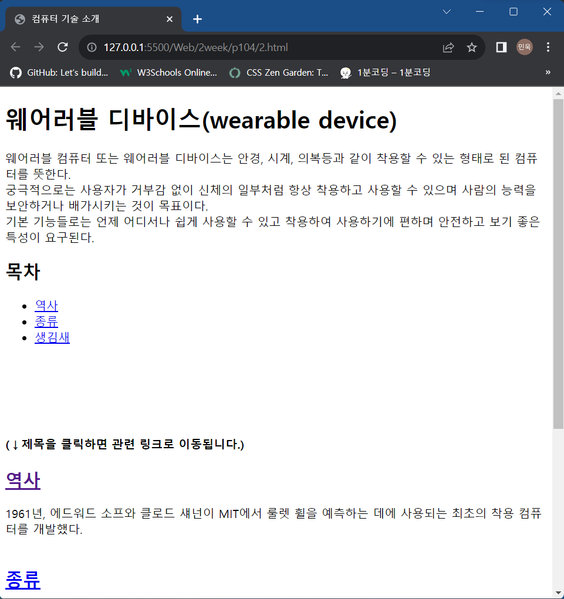

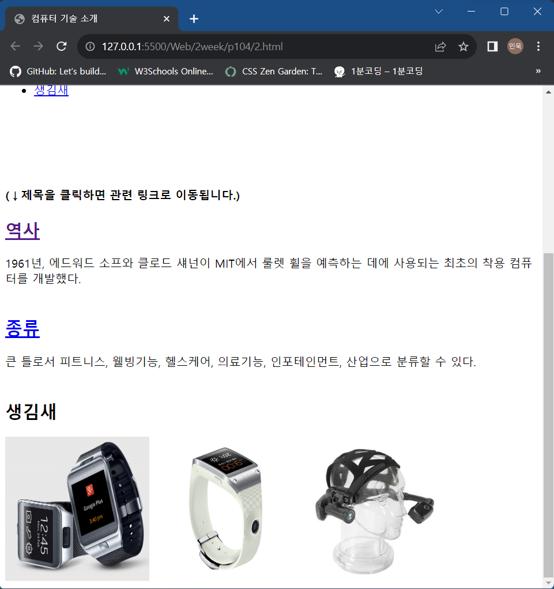

### code

```html
<!DOCTYPE html>
<head>
    <meta charset="UTF-8">
    <title>컴퓨터 기술 소개</title>
</head>
<body>
    <audio autoplay loop> 
        <source src="재생 음악.mp3" type="audio/mp3">
    </audio>

    <h1>웨어러블 디바이스(wearable device)</h1>
    웨어러블 컴퓨터 또는 웨어러블 디바이스는 안경, 시계, 의복등과 같이 착용할 수 있는 형태로 된 컴퓨터를 뜻한다.<br>
    궁극적으로는 사용자가 거부감 없이 신체의 일부처럼 항상 착용하고 사용할 수 있으며 사람의 능력을 보안하거나 배가시키는 것이 목표이다.<br>
    기본 기능들로는 언제 어디서나 쉽게 사용할 수 있고 착용하여 사용하기에 편하며 안전하고 보기 좋은 특성이 요구된다.<br>

    <h2>목차</h2>
    <ul>
        <li><a href="#history">역사</a>
        <li><a href="#type">종류</a>
        <li><a href="#look">생김새</a>
    </ul>
    <br><br><br><br>

    <h4>(↓제목을 클릭하면 관련 링크로 이동됩니다.)</h4>
    <h2 id="history">
        <a 
        href="https://ko.wikipedia.org/wiki/%EC%B0%A9%EC%9A%A9_%EC%BB%B4%ED%93%A8%ED%84%B0"
        target="_blank">
        역사
        </a>
    </h2>
    1961년, 에드워드 소프와 클로드 섀넌이 MIT에서 룰렛 휠을 예측하는 데에 사용되는 최초의 착용 컴퓨터를 개발했다.<br><br>

    <h2 id="type">
        <a 
        href="https://daishinblog.tistory.com/1416"
        target="_blank">
        종류
        </a>
    </h2>
    큰 틀로서 피트니스, 웰빙기능, 헬스케어, 의료기능, 인포테인먼트, 산업으로 분류할 수 있다.<br><br>

    <h2 id="look">
        <h2>생김새</h2>
    </h2>
    
    
    
</body>
</html>
```

# p107

## prac2-01.html

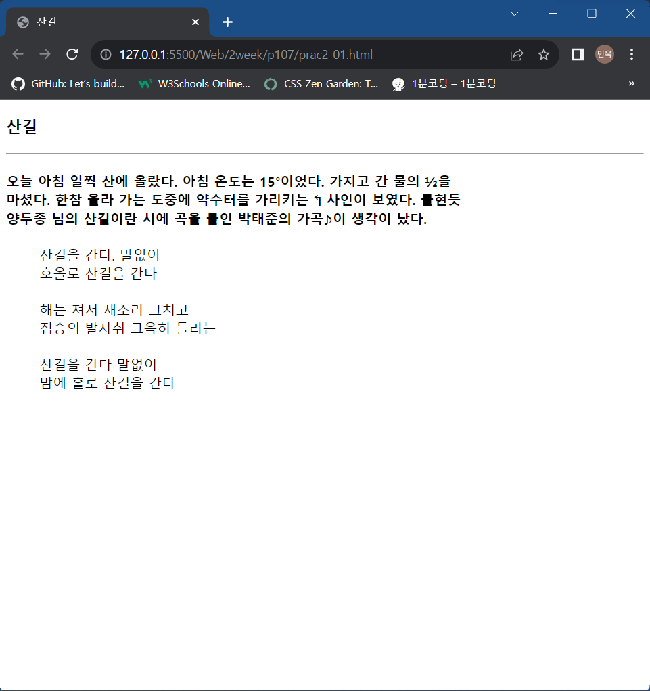

### code

```html
<!DOCTYPE html>
<head>
    <meta charset="UTF-8">
    <title>산길</title>
</head>
<body>
    <h3>산길</h3>
    <hr>
    <h4>
        오늘 아침 일찍 산에 올랐다. 아침 온도는 15°이었다. 가지고 간 물의 ½을<br>
        마셨다. 한참 올라 가는 도중에 약수터를 가리키는 ↰ 사인이 보였다. 불현듯<br>
        양두종 님의 산길이란 시에 곡을 붙인 박태준의 가곡♪이 생각이 났다.<br>
    </h4>
    &nbsp;&nbsp;&nbsp;&nbsp;&nbsp;&nbsp;&nbsp;산길을 간다. 말없이<br>
    &nbsp;&nbsp;&nbsp;&nbsp;&nbsp;&nbsp;&nbsp;호올로 산길을 간다<br>
    <br>
    &nbsp;&nbsp;&nbsp;&nbsp;&nbsp;&nbsp;&nbsp;해는 져서 새소리 그치고<br>
    &nbsp;&nbsp;&nbsp;&nbsp;&nbsp;&nbsp;&nbsp;짐승의 발자취 그윽히 들리는<br>
    <br>
    &nbsp;&nbsp;&nbsp;&nbsp;&nbsp;&nbsp;&nbsp;산길을 간다 말없이<br>
    &nbsp;&nbsp;&nbsp;&nbsp;&nbsp;&nbsp;&nbsp;밤에 홀로 산길을 간다<br>
</body>
</html>
```

# p108

## prac2-02(1).html

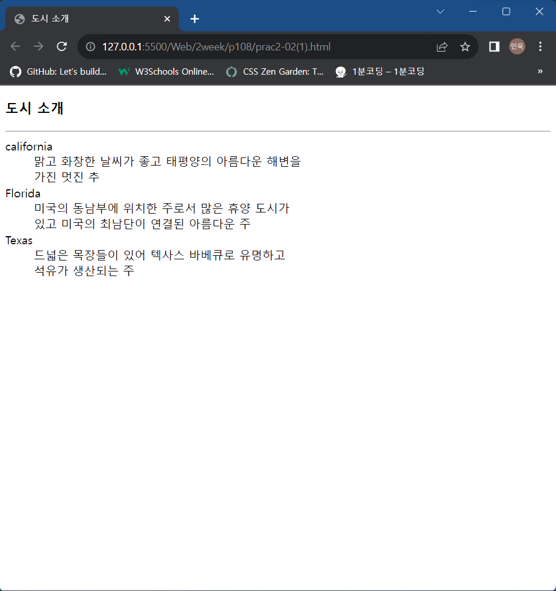

### code

```html
<!DOCTYPE html>
<head>
    <meta charset="UTF-8">
    <title>도시 소개</title>
</head>
<body>
    <h3>도시 소개</h3>
    <hr>
    california<br>
    &nbsp;&nbsp;&nbsp;&nbsp;&nbsp;&nbsp;&nbsp;맑고 화창한 날씨가 좋고 태평양의 아름다운 해변을<br>
    &nbsp;&nbsp;&nbsp;&nbsp;&nbsp;&nbsp;&nbsp;가진 멋진 추<br>
    Florida<br>
    &nbsp;&nbsp;&nbsp;&nbsp;&nbsp;&nbsp;&nbsp;미국의 동남부에 위치한 주로서 많은 휴양 도시가<br>
    &nbsp;&nbsp;&nbsp;&nbsp;&nbsp;&nbsp;&nbsp;있고 미국의 최남단이 연결된 아름다운 주<br>
    Texas<br>
    &nbsp;&nbsp;&nbsp;&nbsp;&nbsp;&nbsp;&nbsp;드넓은 목장들이 있어 텍사스 바베큐로 유명하고<br>
    &nbsp;&nbsp;&nbsp;&nbsp;&nbsp;&nbsp;&nbsp;석유가 생산되는 주
</body>
</html>
```

## prac2-02(2).html

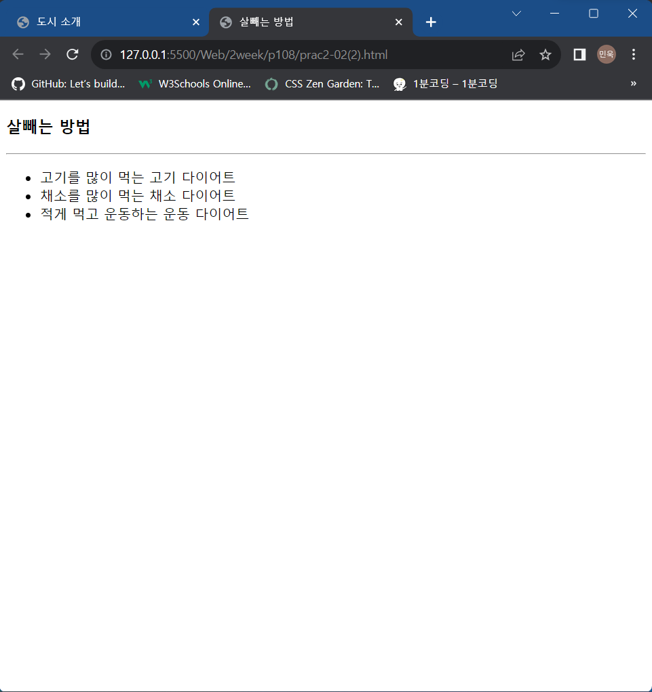

### code

```html
<!DOCTYPE html>
<head>
    <meta charset="UTF-8">
    <title>살빼는 방법</title>
</head>
<body>
    <h3>살빼는 방법</h3>
    <hr>
    <ul>
        <li>고기를 많이 먹는 고기 다이어트</li>
        <li>채소를 많이 먹는 채소 다이어트</li>
        <li>적게 먹고 운동하는 운동 다이어트</li>
    </ul>
</body>
</html>
```

## prac2-03.html

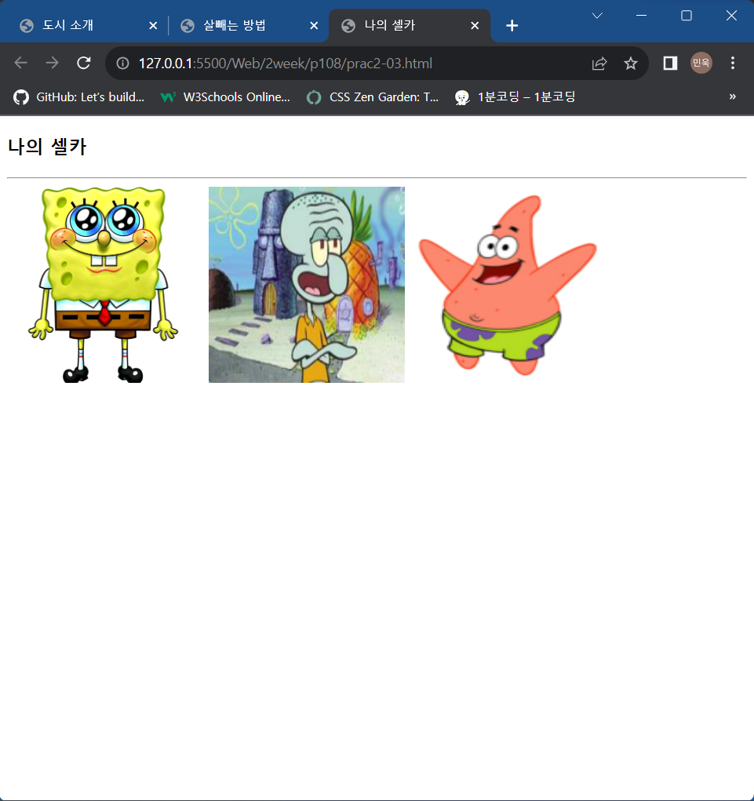

### code

```html
<!DOCTYPE html>
<head>
    <meta charset="UTF-8">
    <title>나의 셀카</title>
</head>
<body>
    <h3>나의 셀카</h3>
    <hr>
    
    
    
</body>
</html>
```

## prac2-04(1).html

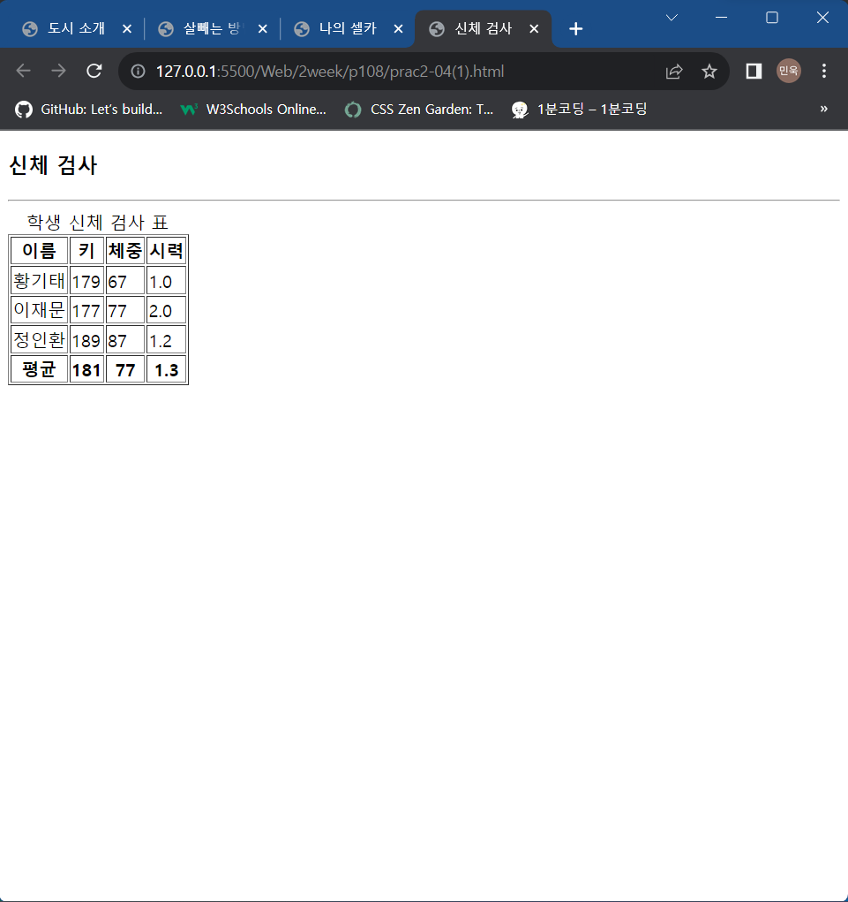

### code

```html
<!DOCTYPE html>
<head>
    <meta charset="UTF-8">
    <title>신체 검사</title>
</head>
<body>
    <h3>신체 검사</h3>
    <hr>
    &nbsp;&nbsp;&nbsp;학생 신체 검사 표<br>
    <table border="1">
        <th>이름</th>
        <th>키</th>
        <th>체중</th>
        <th>시력</th>
        <tr>
            <td>황기태</td>
            <td>179</td>
            <td>67</td>
            <td>1.0</td>
        </tr>
        <tr>
            <td>이재문</td>
            <td>177</td>
            <td>77</td>
            <td>2.0</td>
        </tr>
        <tr>
            <td>정인환</td>
            <td>189</td>
            <td>87</td>
            <td>1.2</td>
        </tr>
        <th>평균</th>
        <th>181</th>
        <th>77</th>
        <th>1.3</th>
    </table>
</body>
</html>
```

## prac2-04(2).html

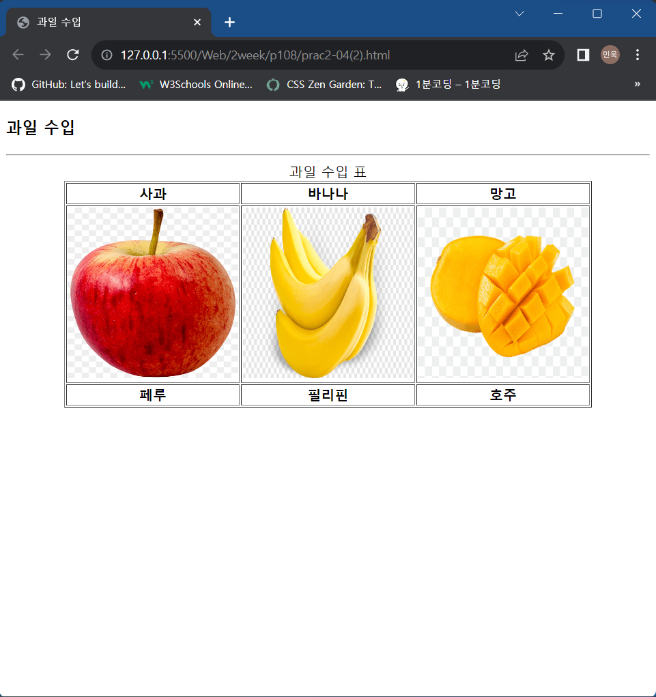

### code

```html
<!DOCTYPE html>
<head>
    <meta charset="UTF-8">
    <title>과일 수입</title>
    <style>
        table {margin-left: auto; margin-right: auto;}
    </style>
</head>
<body>
    <h3>과일 수입</h3>
    <hr>
    <center>과일 수입 표</center>
    <table border="1">
        <th>사과</th>
        <th>바나나</th>
        <th>망고</th>
        <tr>
            <td></td>
            <td></td>
            <td></td>
        </tr>
        <th>페루</th>
        <th>필리핀</th>
        <th>호주</th>
    </table>
</body>
</html>
```

# p109

## prac2-05.html

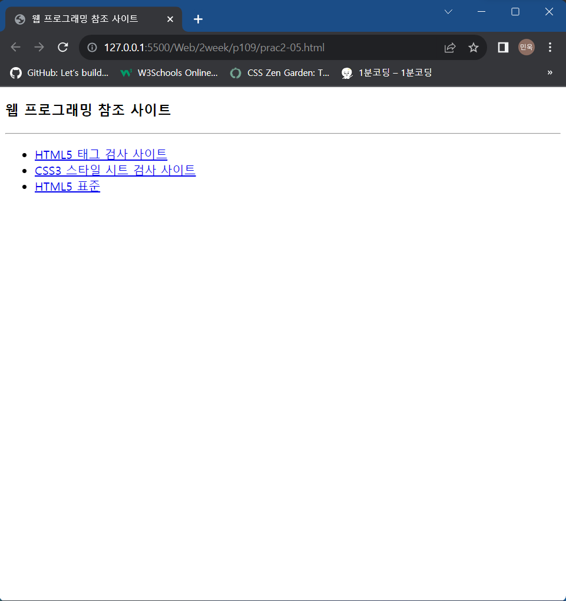

### code

```html
<!DOCTYPE html>
<head>
    <meta charset="UTF-8">
    <title>웹 프로그래밍 참조 사이트</title>
</head>
<body>
    <h3>웹 프로그래밍 참조 사이트</h3>
    <hr>
    <ul>
        <li><a 
            href="https://html5.validator.nu/"
            target="_blank">HTML5 태그 검사 사이트</a>
        <li><a 
            href="https://www.css-validator.org/validator.html.ko"
            target="_blank">CSS3 스타일 시트 검사 사이트</a>
        <li><a 
            href="http://www.html5.org"
            target="_blank">HTML5 표준</a>
    </ul>
</body>
</html>
```

## prac2-06.html

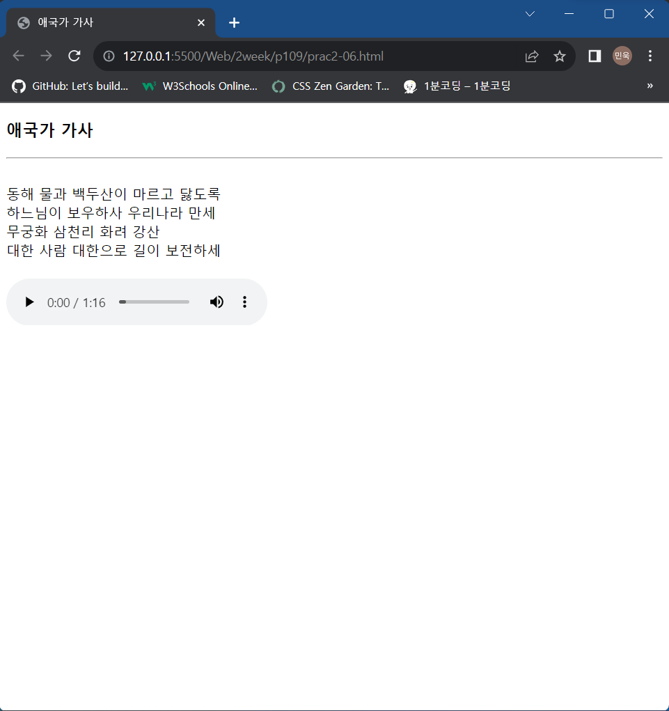

### code

```html
<!DOCTYPE html>
<head>
    <meta charset="UTF-8">
    <title>애국가 가사</title>
</head>
<body>
    <h3>애국가 가사</h3>
    <hr>
    <br>
    동해 물과 백두산이 마르고 닳도록<br>
    하느님이 보우하사 우리나라 만세<br>
    무궁화 삼천리 화려 강산<br>
    대한 사람 대한으로 길이 보전하세<br>
    <br>
    <audio src="애국가 1절.mp3" controls autoplay></audio>
</body>
</html>
```

# p110

## prac2-07.html

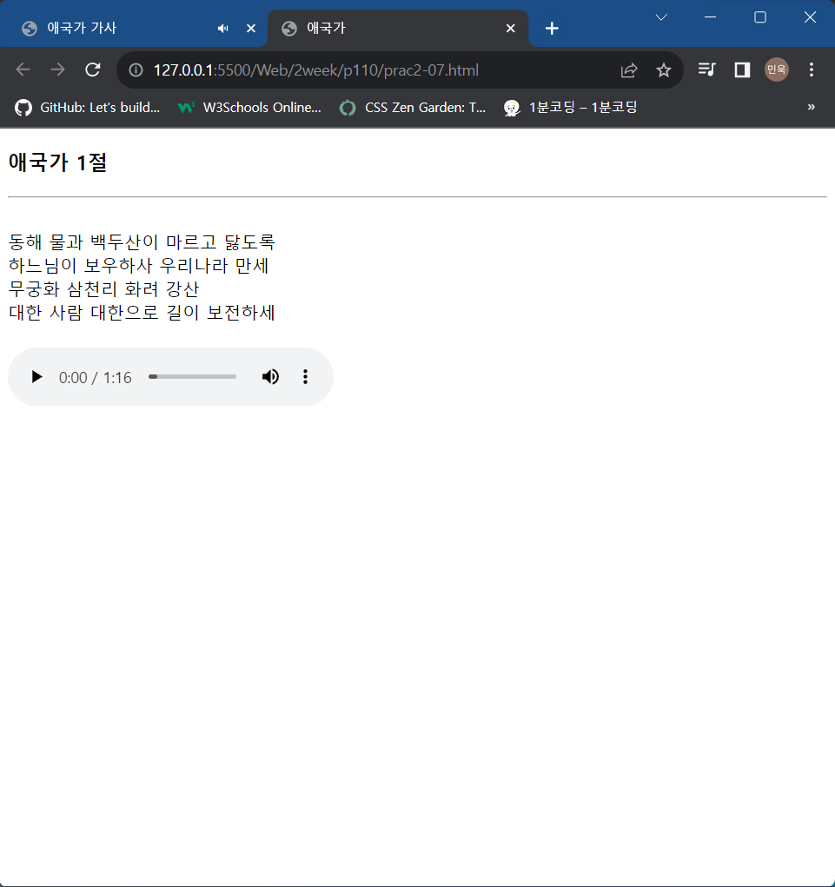

### code

```html
<!DOCTYPE html>
<head>
    <meta charset="UTF-8">
    <meta name="viewport" content="width=device-width, initial-scale=1.0">
    <title>애국가</title>
</head>
<body>
    <h3>애국가 1절</h3>
    <hr>
    <br>
    동해 물과 백두산이 마르고 닳도록<br>
    하느님이 보우하사 우리나라 만세<br>
    무궁화 삼천리 화려 강산<br>
    대한 사람 대한으로 길이 보전하세<br>
    <br>
    <audio src="애국가 1절.mp3" controls></audio>
</body>
</html>
```

## prac2-08.html

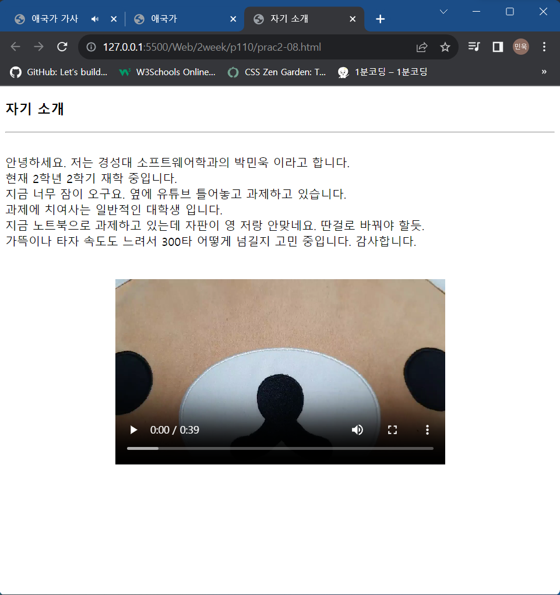

### code

```html
<!DOCTYPE html>
<head>
    <meta charset="UTF-8">
    <meta name="viewport" content="width=device-width, initial-scale=1.0">
    <title>자기 소개</title>
    <style>
        video { 
            max-width: 60%; 
            display: block; 
            margin: 20px auto; 
        }
      </style>
</head>
<body>
    <h3>자기 소개</h3>
    <hr>
    <br>
    안녕하세요. 저는 경성대 소프트웨어학과의 박민욱 이라고 합니다.<br>
    현재 2학년 2학기 재학 중입니다.<br>
    지금 너무 잠이 오구요. 옆에 유튜브 틀어놓고 과제하고 있습니다.<br>
    과제에 치여사는 일반적인 대학생 입니다.<br>
    지금 노트북으로 과제하고 있는데 자판이 영 저랑 안맞네요. 딴걸로 바꿔야 할듯.<br>
    가뜩이나 타자 속도도 느려서 300타 어떻게 넘길지 고민 중입니다. 감사합니다.<br>
    <br>
    <video controls>
        <source src="자기 소개.mp4" type="video/mp4">
        <strong>이 브라우저는 video 태그를 지원하지 않습니다.</strong>
      </video>
</body>
</html>
```