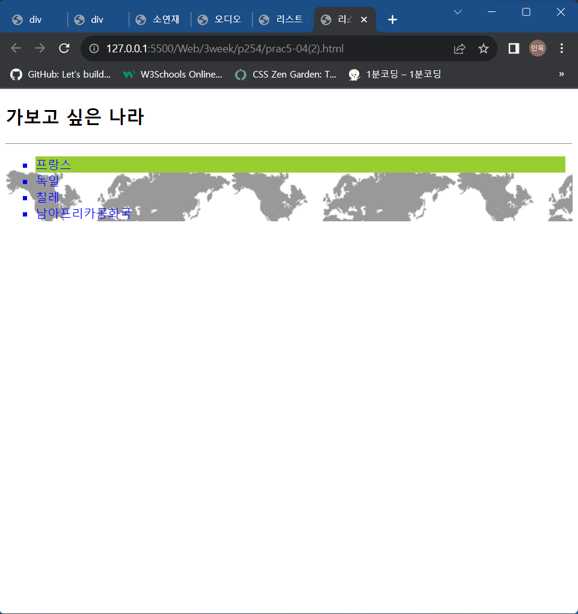
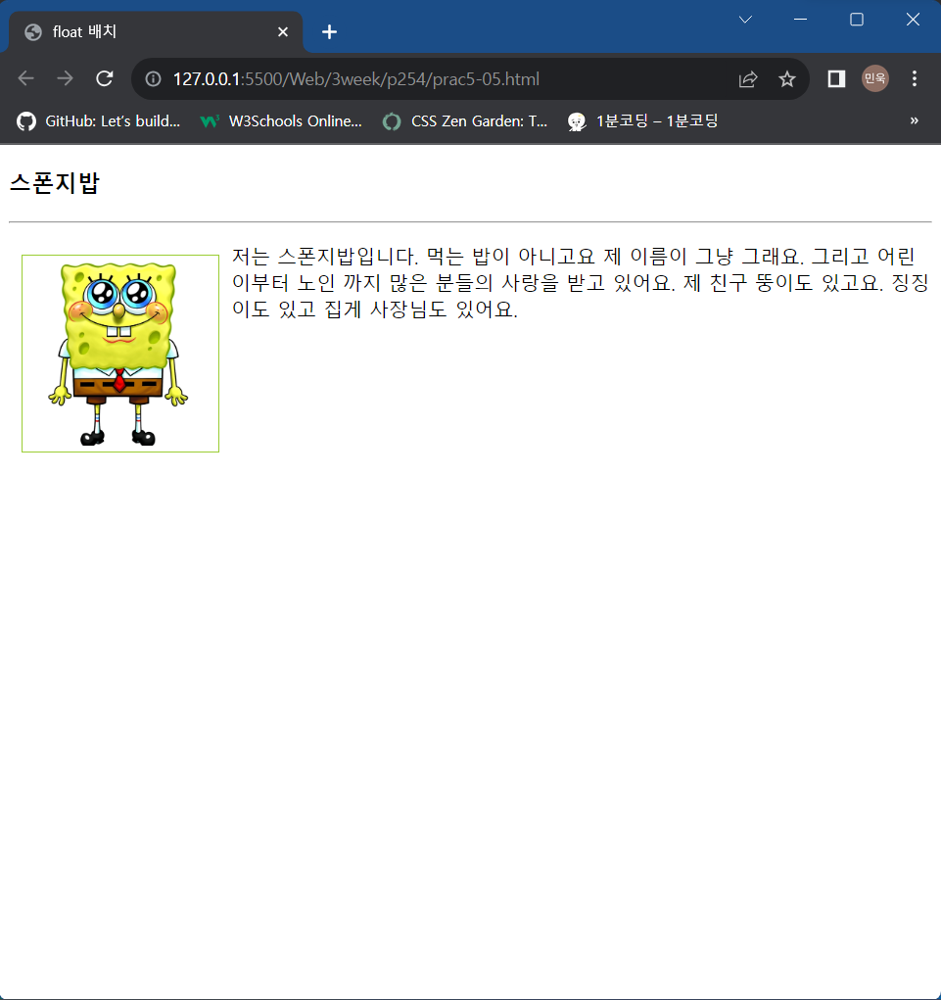

# 3week

# p202

## 4.html


### code

```html
<!DOCTYPE html>
<head>
    <meta charset="UTF-8">
    <title>컴퓨터 기술 소개</title>
    <link href="4.css" type="text/css" rel="stylesheet">
</head>
<body>
    <audio autoplay loop> 
        <source src="재생 음악.mp3" type="audio/mp3">
    </audio>

    <h1>웨어러블 디바이스(wearable device)</h1>
    <p>웨어러블 컴퓨터 또는 웨어러블 디바이스는 안경, 
        시계, 의복등과 같이 착용할 수 있는 형태로 된 
        컴퓨터를 뜻한다. 궁극적으로는 사용자가 거부감 
        없이 신체의 일부처럼 항상 착용하고 사용할 수 
        있으며 사람의 능력을 보안하거나 배가시키는 
        것이 목표이다.기본 기능들로는 언제 어디서나 
        쉽게 사용할 수 있고 착용하여 사용하기에 편하며 
        안전하고 보기 좋은 특성이 요구된다.
    </p>
    <hr>
    <div id="wrap">
        <h2><a>목차</a></h2>
        <ul>
            <li><a href="#history">역사</a>
            <li><a href="#type">종류</a>
            <li><a href="#look">생김새</a>
        </ul>

        <h4>(↓제목을 클릭하면 관련 링크로 이동됩니다.)</h4>
        <h2 id="history">
            <a 
            href="https://ko.wikipedia.org/wiki/%EC%B0%A9%EC%9A%A9_%EC%BB%B4%ED%93%A8%ED%84%B0"
            target="_blank">
            역사
            </a>
        </h2>
        <p>
            1961년, 에드워드 소프와 클로드 섀넌이 
            MIT에서 룰렛 휠을 예측하는 데에 사용되는 
            최초의 착용 컴퓨터를 개발했다.<br><br>
        </p>

        <h2 id="type">
            <a 
            href="https://daishinblog.tistory.com/1416"
            target="_blank">
            종류
            </a>
        </h2>
        <p>
            큰 틀로서 피트니스, 웰빙기능, 헬스케어, 
            의료기능, 인포테인먼트, 산업으로 분류할 수 
            있다.<br><br>
        </p>

        <h2 id="look">
            <h2><a>생김새</a></h2>
        </h2>
        
        
        
    </div>
    <footer>
        <p>
            출처<br>
            <br>
            &nbsp;&nbsp;위키피디아
        </p>
    </footer>
</body>
</html>
```

## 4.css

### code

```css
@font-face {
    font-family: '휴먼편지체';
    src: url(휴먼편지체.ttf);
}
h1 {
    color: brown;
    text-align: center;
}
hr {
    height: 1px;
    color: black;
}
body {
    background: aliceblue;
}
ul {
    border: 1px dashed black;
}
a {
    text-decoration: none;
}
h2 {
    color: blue;
    text-shadow: 2px 2px 2px skyblue;
}
p {
    font-family: '휴먼편지체';
    font-size: 1em;
    text-indent: 1em;
}
html, body {
    height: 100%;
    padding: 0px;
    margin: 0px;
}
#wrap {
    min-height: calc(100% - 120px)
}
footer {
    background-color: orange;
    border-radius: 10px;
}
```

## survey4.html


### code

```html
<!DOCTYPE html>
<head>
    <meta charset="UTF-8">
    <title>소프트웨어 기술 선호</title>
    <link href="survey4.css" type="text/css" rel="stylesheet">
</head>
<body>
    <h1>설문지</h1>
    <p>
        소프트웨어 기술에 대한 의견을 듣습니다.
        많은 참여 부탁드립니다.
    </p>
    <hr>
    <div id="wrap">
        <strong>학년</strong>
        <input type="radio" name="grade" value="1학년" /> <b>1학년</b>
        <input type="radio" name="grade" value="2학년" /> <b>2학년</b>
        <input type="radio" name="grade" value="3학년" /> <b>3학년</b>
        <input type="radio" name="grade" value="4학년" /> <b>4학년</b>
        <br><br><br>
        <strong>성별</strong>
        <input type="radio" name="sex" value="남" /> <b>남</b>
        <input type="radio" name="sex" value="여" /> <b>여</b>
        <br><br><br>
        <strong>관심 분야</strong>
        <select name="field">
            <option value="mobile">모바일 소프트웨어</option>
            <option value="frontend">프론트엔드</option>
            <option value="backend">백엔드</option>
            <option value="game">게임</option>
            <option value="embedded">임베디드</option>
        </select>
        <br><br><br>
        <strong>진로(다중 선택)</strong>
        <input type="checkbox" name="course" value="개발" /> <b>개발</b>
        <input type="checkbox" name="course" value="기획" /> <b>기획</b>
        <input type="checkbox" name="course" value="영업" /> <b>영업</b>
        <input type="checkbox" name="course" value="창업" /> <b>창업</b>
        <br><br><br>
        <strong>남기고 싶은 말</strong>
        <textarea placeholder="글을 남겨주세요" name="string"></textarea>
    </div>
    <footer><p>copyright 2017 by Kitae</p></footer>
</body>
</html>
```

## survey4.css

### code

```css
@font-face {
    font-family: '휴먼편지체';
    src: url(휴먼편지체.ttf);
}
h1 {
    color: brown;
    text-align: center;
}
hr {
    margin-left: 10px;
    margin-right: 10px;
    height: 1px;
    color: black;
}
body {
    background: aliceblue;
}
ul {
    border: 1px dashed black;
}
a {
    text-decoration: none;
}
h2 {
    color: blue;
    text-indent: 1em;
}
p {
    font-family: '휴먼편지체';
    font-size: 20px;
    text-indent: 1em;
}
html, body {
    height: 100%;
    padding: 0px;
    margin: 0px;
}
#wrap {
    min-height: calc(100% - 120px)
}
footer {
    background-color: orange;
    border-radius: 30px;
    margin-left: 20px;
    margin-right: 20px;
}
div {
    background-color: hotpink;
    margin-top: 30px;
    margin-bottom: 30px;
    margin-left: 30px;
    margin-right: 30px;
}
strong {
    color: blue;
    font-size: 20px;
    margin-left: 20px;
}
b {
    font-family: '휴먼편지체';
    font-size: 20px;
    text-indent: 1em;
}
textarea {
    width: 13cm;
    height: 7cm;
}
```

# p207

## prac4-01.html


### code

```html
<!DOCTYPE html>
<head>
    <meta charset="UTF-8">
    <title>태그 셀렉터 만들기</title>
    <link href="prac4-01.css" type="text/css" rel="stylesheet">
</head>
<body>
    <h3>소연재</h3>
    <hr>
    <p>저는 체조 선수 소연재입니다. <span>음악</span>
    을 들으면서 책읽기를 좋아합니다.
    <span>김치찌개</span>와 <span>막국수</span>
    무척 좋아합니다.</p>
</body>
</html>
```

## prac4-01.css

### code

```css
h3 {
    text-align: right;
    color: blue;
}
body {
    background-color: bisque;
}
span {
    background-color: dodgerblue;
    color: blue;
}
p {
    color: brown;
}
```

## prac4-02.html


### code

```html
<!DOCTYPE html>
<head>
    <meta charset="UTF-8">
    <title>텍스트 꾸미기</title>
    <link href="prac4-02.css" type="text/css" rel="stylesheet">
</head>
<body>
    <h3>텍스트와 폰트</h3>
    <hr>
    <p>
        AliceBlue 바탕 색에 Brown 색의 "Lucida console" 
        폰트로 10px 크기이고 <span>저는 이보다 1.5배 큽니다</span>
    </p>
</body>
</html>
```

## prac4-02.css

### code

```css
p {
    background-color: aliceblue;
    color: brown;
    font-family: 'Lucida console';
}
span {
    font-size: 150%;
    text-decoration: underline;
}
```

## prac4-03.html


### code

```html
<!DOCTYPE html>
<head>
    <meta charset="UTF-8">
    <title>색 테이블 만들기</title>
</head>
<body>
    <h3>색 이름과 코드</h3>
    <hr>
    <table border="1">
        <th width="100px">이름</th>
        <th width="70px">코드</th>
        <th width="70px">색</th>
        <th width="100px">이름</th>
        <th width="70px">코드</th>
        <th width="70px">색</th>
        <tr>
            <td>brown</td>
            <td>#A52A2A</td>
            <td bgcolor="#A52A2A"></td>
            <td>DeepSkyBlue</td>
            <td>#00BFFF</td>
            <td bgcolor="#00BFFF"></td>
        </tr>
        <tr>
            <td>Blueviolet</td>
            <td>#8A2BE2</td>
            <td bgcolor="#8A2BE2"></td>
            <td>Gold</td>
            <td>#FFD700</td>
            <td bgcolor="#FFD700"></td>
        </tr>
        <tr>
            <td>DarkOrange</td>
            <td>#FF8C00</td>
            <td bgcolor="#FF8C00"></td>
            <td>OliveDrab</td>
            <td>#6B8E23</td>
            <td bgcolor="#6B8E23"></td>
        </tr>
    </table>
</body>
</html>
```

# p208

## prac4-04.html


### code

```html
<!DOCTYPE html>
<head>
    <meta charset="UTF-8">
    <title>셀렉터 만들기</title>
    <link href="prac4-04.css" type="text/css" rel="stylesheet">
</head>
<body class="main">
    <h3 class="headline">클래스 셀렉터</h3>
    <hr>
    <div class="help">도움말</div>
    <p class="help">!!경고 메세지</p>
    <p id="hot">뜨거운 태양</p>
</body>
</html>
```

## prac4-04.css

### code

```css
body.main {
    background-color: lightseagreen;
}
h3.headline {
    text-align: center;
    font-size: 40px;
    color: brown;
}
div.help {
    height: 50px;
    color: blue;
}
p.help {
    color: red;
    font-size: 30px;
}
#hot {
    background-color: orange;
}
```

## prac4-05.html


### code

```html
<!DOCTYPE html>
<head>
    <meta charset="UTF-8">
    <title>셀렉터</title>
    <link href="prac4-05.css" type="text/css" rel="stylesheet">
</head>
<body class="main">
    <h3>얼굴</h3>
    <hr>
    <div id="center"><strong>박인희</strong></div>
    <div class="indent">
        <p><em>길</em>을 걷고 산들 무엇하리
        <strong>꽃</strong>이 내가 아니듯 내가
        <strong>꽃</strong>이 될 수 없는 지금...</p>
    </div>
</body>
</html>
```

## prac4-05.css

### code

```css
body.main {
    background-color: lightseagreen;
}
#center strong {
    background-color: yellow;
}
#center {
    text-align: center;
}
p {
    text-indent: 50px;
}
p > em {
    color: green;
}
p > strong {
    color: red;
}
```

## prac4-06.html


### 마우스를 올렸을 때


### code

```html
<!DOCTYPE html>
<head>
    <meta charset="UTF-8">
    <title>링크 꾸미기</title>
    <link href="prac4-06.css" type="text/css" rel="stylesheet">
</head>
<body>
    <h3>링크 꾸미기</h3>
    초록색에 밑줄없는 링크. 마우스를 올리면 밑줄과
    violet 색으로 변경
    <hr>
    <ul>
        <li><a href="https://www.naver.com/">네이버 사이트</a></li>
        <li><a href="https://www.google.co.kr/">구글 사이트</a></li>
    </ul>
</body>
</html>
```

## prac4-06.css

### code

```css
a {
    text-decoration: none;
}
a:link {
    color: green;
}
a:visited {
    color: green;
}
a:hover {
    color: violet;
    text-decoration: underline;
}
```

# p209

## prac4-07.html


### 마우스를 올렸을 때


### code

```html
<!DOCTYPE html>
<head>
    <meta charset="UTF-8">
    <title>:hover 활용</title>
    <style>
        div {
            width: 100px;
            height: 140px;
            background-image: url("back.png");
            background-size: 100px 140px;
        }
        div:hover {
            background-image: url("spade-7.png");
        }
    </style>
</head>
<body>
    <h3>:hover 활용</h3>
    <hr>
    <table>
        <tr>
            <td>마우스를 올리면 카드의 앞면이 보인다.</td>
            <td><div></div></td>
        </tr>
    </table>
</body>
</html>
```

## prac4-08.html


### code

```html
<!DOCTYPE html>
<head>
    <meta charset="UTF-8">
    <title>이미지 테두리 만들기</title>
    <style>
        img {
            padding: 5px;
            border: 15px solid white;
            border-image: url("check_pattern.png") 30 round;
        }
    </style>
</head>
<body>
    <h3>이미지 테두리 만들기</h3>
    <hr>
    
</body>
</html>
```

## prac4-09.html


박스를 누르면 해당 링크로 이동

### code

```html
<!DOCTYPE html>
<head>
    <meta charset="UTF-8">
    <title>text-shadow와 box-shadow</title>
    <style>
        h1 {
            color: yellow;
            text-align: center;
            text-shadow: 2px 2px 2px gray;
        }
        img:hover {
            box-shadow: 2px 2px 2px gray;
        }
    </style>
</head>
<body>
    <h1>Most Visited Pages</h1>
    <hr>
    <table>
        <tr>
            <td>
                <a href="http://www.naver.com">
                    
                </a>
            </td>
            <td>
                <a href="http://www.chosun.com">
                    
                </a>
            </td>
            <td>
                <a href="http://www.amazon.com">
                    
                </a>
            </td>
        </tr>
    </table>
</body>
</html>
```

# p249

## 5.html


### code

```html
<!DOCTYPE html>
<head>
    <meta charset="UTF-8">
    <title>컴퓨터 기술 소개</title>
    <link href="5.css" type="text/css" rel="stylesheet">
</head>
<body>
    <header>
    <h1>웨어러블 디바이스(wearable device)</h1>
    <p>웨어러블 컴퓨터 또는 웨어러블 디바이스는 안경, 
        시계, 의복등과 같이 착용할 수 있는 형태로 된 
        컴퓨터를 뜻한다. 궁극적으로는 사용자가 거부감 
        없이 신체의 일부처럼 항상 착용하고 사용할 수 
        있으며 사람의 능력을 보안하거나 배가시키는 
        것이 목표이다.기본 기능들로는 언제 어디서나 
        쉽게 사용할 수 있고 착용하여 사용하기에 편하며 
        안전하고 보기 좋은 특성이 요구된다.
    </p>
    <audio controls autoplay loop> 
        <source src="재생 음악.mp3" type="audio/mp3">
    </audio>
    </header>

    <div id="wrap">
        <nav>
            <h2><a>목차</a></h2>
            <ul>
                <li><a href="#history">역사</a>
                <li><a href="#type">종류</a>
                <li><a href="#look">생김새</a>
            </ul>
        </nav> 

        <section>
        <h4>(↓제목을 클릭하면 관련 링크로 이동됩니다.)</h4>
        <h2 id="history">
            <a 
            href="https://ko.wikipedia.org/wiki/%EC%B0%A9%EC%9A%A9_%EC%BB%B4%ED%93%A8%ED%84%B0"
            target="_blank">
            역사
            </a>
        </h2>
        <p>
            1961년, 에드워드 소프와 클로드 섀넌이 
            MIT에서 룰렛 휠을 예측하는 데에 사용되는 
            최초의 착용 컴퓨터를 개발했다.<br><br>
        </p>

        <h2 id="type">
            <a 
            href="https://daishinblog.tistory.com/1416"
            target="_blank">
            종류
            </a>
        </h2>
        <p>
            큰 틀로서 피트니스, 웰빙기능, 헬스케어, 
            의료기능, 인포테인먼트, 산업으로 분류할 수 
            있다.<br><br>
        </p>

        <h2 id="look">
            <h2><a>생김새</a></h2>
        </h2>
        
        
        
    </div>
    </section>
    <footer>
        <p>
            출처<br>
            <br>
            &nbsp;&nbsp;위키피디아
        </p>
    </footer>
</body>
</html>
```

## 5.css

### code

```css
@font-face {
    font-family: '휴먼편지체';
    src: url(휴먼편지체.ttf);
}
h1 {
    color: brown;
    text-align: center;
}
hr {
    height: 1px;
    color: black;
}
body {
    background: aliceblue;
}
ul {
    border: 1px dashed black;
}
a {
    text-decoration: none;
}
h2 {
    color: blue;
    text-shadow: 2px 2px 2px skyblue;
}
p {
    font-family: '휴먼편지체';
    font-size: 1em;
    text-indent: 1em;
}
html, body {
    height: 100%;
    padding: 0px;
    margin: 0px;
}
#wrap {
    min-height: calc(100% - 120px)
}
footer {
    float: left;
    background-color: purple;
    height: 10%;
    width: 100%;
}
nav {
    float: left;
    height: 25cm;
    width: 20%;
    background-color: orange;
}
section {
    float: right;
    height: 25cm;
    width: 80%;
    background-color: skyblue;
}
header {
    height: 35%;
    width: 100%;
    background-color: yellow;
    float: left;
}
```

## survey5.html


### code

```html
<!DOCTYPE html>
<head>
    <meta charset="UTF-8">
    <title>소프트웨어 기술 선호</title>
    <link href="survey5.css" type="text/css" rel="stylesheet">
</head>
<body>
    <header>
    <h1>설문지</h1>
    <p>
        소프트웨어 기술에 대한 의견을 듣습니다.
        많은 참여 부탁드립니다.
    </p>
    </header>
    <div id="wrap">
        <strong>학년</strong>
        <input type="radio" name="grade" value="1학년" /> <b>1학년</b>
        <input type="radio" name="grade" value="2학년" /> <b>2학년</b>
        <input type="radio" name="grade" value="3학년" /> <b>3학년</b>
        <input type="radio" name="grade" value="4학년" /> <b>4학년</b>
        <br><br><br>
        <strong>성별</strong>
        <input type="radio" name="sex" value="남" /> <b>남</b>
        <input type="radio" name="sex" value="여" /> <b>여</b>
        <br><br><br>
        <strong>관심 분야</strong>
        <select name="field">
            <option value="mobile">모바일 소프트웨어</option>
            <option value="frontend">프론트엔드</option>
            <option value="backend">백엔드</option>
            <option value="game">게임</option>
            <option value="embedded">임베디드</option>
        </select>
        <br><br><br>
        <strong>진로(다중 선택)</strong>
        <input type="checkbox" name="course" value="개발" /> <b>개발</b>
        <input type="checkbox" name="course" value="기획" /> <b>기획</b>
        <input type="checkbox" name="course" value="영업" /> <b>영업</b>
        <input type="checkbox" name="course" value="창업" /> <b>창업</b>
        <br><br><br>
        <strong>남기고 싶은 말</strong>
        <textarea placeholder="글을 남겨주세요" name="string"></textarea>
    </div>
    <footer><p>copyright 2017 by Kitae</p></footer>
</body>
</html>
```

## survey5.css

### code

```css
@font-face {
    font-family: '휴먼편지체';
    src: url(휴먼편지체.ttf);
}
h1 {
    color: brown;
    text-align: center;
}
hr {
    margin-left: 10px;
    margin-right: 10px;
    height: 1px;
    color: black;
}
body {
    background: aliceblue;
}
ul {
    border: 1px dashed black;
}
a {
    text-decoration: none;
}
h2 {
    color: blue;
    text-indent: 1em;
}
p {
    font-family: '휴먼편지체';
    font-size: 20px;
    text-indent: 1em;
}
html, body {
    height: 100%;
    padding: 0px;
    margin: 0px;
}
#wrap {
    min-height: calc(100% - 120px)
}
footer {
    background-color: purple;
    float: left;
    width: 100%;
    height: 15%;
}
div {
    background-color: hotpink;
    margin-bottom: 30px;
    margin-left: 30px;
    margin-right: 30px;
}
strong {
    color: blue;
    font-size: 20px;
    margin-left: 20px;
}
b {
    font-family: '휴먼편지체';
    font-size: 20px;
    text-indent: 1em;
}
textarea {
    width: 13cm;
    height: 7cm;
}
header {
    float: left;
    background-color: yellow;
    width: 100%;
    height: 20%;
}
```

# p253

## prac5-01(1).html


### code

```html
<!DOCTYPE html>
<head>
    <meta charset="UTF-8">
    <title>div</title>
    <style>
        div {
            border: 2px solid yellowgreen;
            width: 200px;
            display: inline-block;
        }
    </style>
</head>
<body>
    <h3>3개의 div 활용</h3>
    <hr>
    <div>
        캔버스에 이미지를 그리기 위해서는 이미지를 담을 
        객체가 먼저 필요하다.
    </div>
    <div>
        Image 객체의 src 프로퍼티를 이용하여 비트맵을 
        로드한다.
    </div>
    <div>
        이미지 로딩이 끝나면 그때 비로소 이미지의 너비와 
        높이가 제대로 알려진다.
    </div>
</body>
</html>
```

## prac5-01(2).html


### code

```html
<!DOCTYPE html>
<head>
    <meta charset="UTF-8">
    <title>div</title>
    <style>
        div {
            border: 2px solid yellowgreen;
            width: 200px;
            display: inline;
        }
    </style>
</head>
<body>
    <h3>3개의 div 활용</h3>
    <hr>
    <div>
        캔버스에 이미지를 그리기 위해서는 이미지를 담을 
        객체가 먼저 필요하다.
    </div>
    <div>
        Image 객체의 src 프로퍼티를 이용하여 비트맵을 
        로드한다.
    </div>
    <div>
        이미지 로딩이 끝나면 그때 비로소 이미지의 너비와 
        높이가 제대로 알려진다.
    </div>
</body>
</html>
```

## prac5-02.html


### code

```html
<!DOCTYPE html>
<head>
    <meta charset="UTF-8">
    <title>소연재</title>
    <style>
        footer {
            background-color: purple;
            position: fixed;
            width: 100%;
            bottom: 0;
        }
    </style>
</head>
<body>
    <h3>소연재</h3>
    <hr>
    <p>
        저는 체조 선수 소연재입니다. 음악을 들으면서 
        책읽기를 좋아합니다. 김치 찌개와 막국수 무척 
        좋아합니다.
    </p>
    <footer>소연재 공연은 24일 입니다.</footer>
</body>
</html>
```

# p254

## prac5-03.html


### code

```html
<!DOCTYPE html>
<head>
    <meta charset="UTF-8">
    <title>오디오 재생 리스트</title>
    <style>
        td.number {
            border: 1px solid yellowgreen;
        }
        th {
            text-align: left;
            border-bottom: 1px solid;
            width: 250px;
        }
        button:hover {
            color: magenta;
        }
    </style>
</head>
<body>
    <h3>오디오 재생 리스트</h3>
    <hr>
    <table>
        <tr>
            <td class="number">1</td><th>애국가</th>
            <td><button>재생</button></td>
            <td><button>중지</button></td>
        </tr>
        <tr>
            <td class="number">2</td><th>Moon Glow</th>
            <td><button>재생</button></td>
            <td><button>중지</button></td>
        </tr>
        <tr>
            <td class="number">3</td><th>Embraceable You</th>
            <td><button>재생</button></td>
            <td><button>중지</button></td>
        </tr>
    </table>
</body>
</html>
```
## prac5-04(1).html


### 마우스를 올렸을 때


### code

```html
<!DOCTYPE html>
<head>
    <meta charset="UTF-8">
    <title>리스트 만들기</title>
    <style>
        li:hover {
            background-color: yellowgreen;
        }
        ul {
            background-color: aliceblue;
            padding-right: 10px;
        }
        li {
            list-style-type: square;
        }
    </style>
</head>
<body>
    <h2>가보고 싶은 나라</h2>
    <hr>
    <ul>
        <li>프랑스</li>
        <li>독일</li>
        <li>칠레</li>
        <li>남아프리카공화국</li>
    </ul>
</body>
</html>
```

## prac5-04(2).html


### 마우스를 올렸을 때



### code

```html
<!DOCTYPE html>
<head>
    <meta charset="UTF-8">
    <title>리스트 만들기</title>
    <style>
        li:hover {
            background-color: yellowgreen;
        }
        ul {
            padding-right: 10px;
            background-image: url(worldmap.png); 
        }
        li {
            list-style-type: square;
            color: blue;
        }
    </style>
</head>
<body>
    <h2>가보고 싶은 나라</h2>
    <hr>
    <ul>
        <li>프랑스</li>
        <li>독일</li>
        <li>칠레</li>
        <li>남아프리카공화국</li>
    </ul>
</body>
</html>
```

## prac5-05.html



### code

```html
<!DOCTYPE html>
<head>
    <meta charset="UTF-8">
    <title>float 배치</title>
    <style>
        img {
            float: left;
            border: 1px solid yellowgreen;
            left: 10px;
            margin: 10px;
            padding: 5px;
        }
    </style>
</head>
<body>
    <h3>스폰지밥</h3>
    <hr>
    <div>
        
        <p>
            저는 스폰지밥입니다. 먹는 밥이 아니고요 제 
            이름이 그냥 그래요. 그리고 어린이부터 노인
            까지 많은 분들의 사랑을 받고 있어요. 제 
            친구 뚱이도 있고요. 징징이도 있고 집게 
            사장님도 있어요.
        </p>
    </div>
</body>
</html>
```

# p255

## prac5-06(1).html


사진이 계속 오른쪽 방향으로 돌아간다.

### code

```html
<!DOCTYPE html>
<head>
    <meta charset="UTF-8">
    <title>animation</title>
    <style>
        @keyframes rotate {
            from {
                transform: rotate(0deg);
            }
            to {
                transform: rotate(1turn);
            }
        }
        img {
            
            animation: rotate 1s infinite linear;
        }
    </style>
</head>
<body>
    <h3>어지러워요</h3>
    <hr>
    

</body>
</html>
```

## prac5-06(2).html


좌, 우로 왔다 갔다 한다.

### code

```html
<!DOCTYPE html>
<head>
    <meta charset="UTF-8">
    <title>animation</title>
    <style>
        @keyframes rotate1 {
            0% {
                transform: rotate(0deg);
            }
            25% {
                transform: rotate(-90deg);
            }
            50% {
                transform: rotate(0deg);
            }
            75% {
                transform: rotate(90deg);
            }
            100% {
                transform: rotate(0deg);
            }
        }
        img {
            animation: rotate1 1s infinite linear ;
        }
    </style>
</head>
<body>
    <h3>어지러워요</h3>
    <hr>
    
</body>
</html>
```

## prac5-07.html


### 마우스를 올렸을 때


2초에 걸쳐 늘어난다.

### code

```html
<!DOCTYPE html>
<head>
    <meta charset="UTF-8">
    <title>transition</title>
    <style>
        img {
            transition: width 2s;
        }
        img:hover {
            width: 100%;
        }
    </style>
</head>
<body>
    <h3>마우스를 올려봐요</h3>
    <hr>
    
</body>
</html>
```

## prac5-08.html


### 마우스를 올렸을 때


### code

```html
<!DOCTYPE html>
<html>
<head>
<meta charset="UTF-8">
<title>리스트 배경</title>
<style>
ul {
	background: olive;
	padding: 10px 10px 10px 15px;
    width: 100px;
    list-style-type: none;
}
ul li {
    color: white;
	margin-bottom: 5px;
    display: block;
}
ul li:hover {
    color: violet;
}
</style>
</head>
<body>
<h3>커피 메뉴</h3>
<hr>
<ul>
    <li>Home</li>
	<li>Espresso</li>
	<li>Cappuccino</li>
	<li>Cafe Latte</li>
    <li>F.A.O</li>
</ul>
</body>
</html>
```

## prac5-09.html


### code

```html
<!DOCTYPE html>
<head>
    <meta charset="UTF-8">
    <title>카푸치노 만들기</title>
    <style>
        div {
            width: 300px;
            border: 2px solid orange;
        }
        div h3 {
            text-align: center;
        }
        ol {
            list-style-type: none;
            padding: 0 20px 0 20px;
        }
        ol li {
            padding-left: 5px;
            margin-bottom: 10px;
        }
        ol li span {
            position: absolute;
            font:bold italic 35px Helvetica;
            color: olive;
        }
        ol li p {
            padding-left: 50px;
        }
    </style>
</head>
<body>
    <h3>카푸치노</h3>
    <hr>
    <div>
        <h3>카푸치노 만드는 순서</h3>
        <ol>
            <li><span>1.</span><p>에스프레소를 
                추출한다. 반드시 에스프레소 콩을 
            사용해야 제맛이 난다.
            </p></li>
            <li><span>2.</span><p>적당한 용기에 
                우유를 넣어 중탕을 하거나 끓기 직전
                까지 데운다.
            </p></li>
            <li><span>3.</span><p>몇초간 저어 충분히 
                거품을 낸다. 거품이 충분하지 않으면 
                풍미가 떨어진다.
            </p></li>
            <li><span>4.</span><p>컵에 계피 막대를 
                꽂고 커피를 부은후 우유 거품을 붓는다. 
                휘핑크림을 얹고 계피가루를 뿌린다.
            </p></li>
        </ol>
    </div>
</body>
</html>
```

## prac5-10.html


웹 페이지 오른쪽에서 3초에 걸쳐 왼쪽에 정렬된다.

### code

```html
<!DOCTYPE html>
<head>
    <meta charset="UTF-8">
    <title>애니메이션 응용</title>
    <style>
        @keyframes move {
            from {
                margin-left: 100%;
            }
            to {
                margin-left: 0%;
            }
        }
        p {
            animation: move 3s 1 ease;
        }
    </style>
</head>
<body>
    <h3>애니메이션 응용</h3>
    <hr>
    <p>질문 있습니다.</p>
</body>
</html>
```

# sourcecode

## index.html


