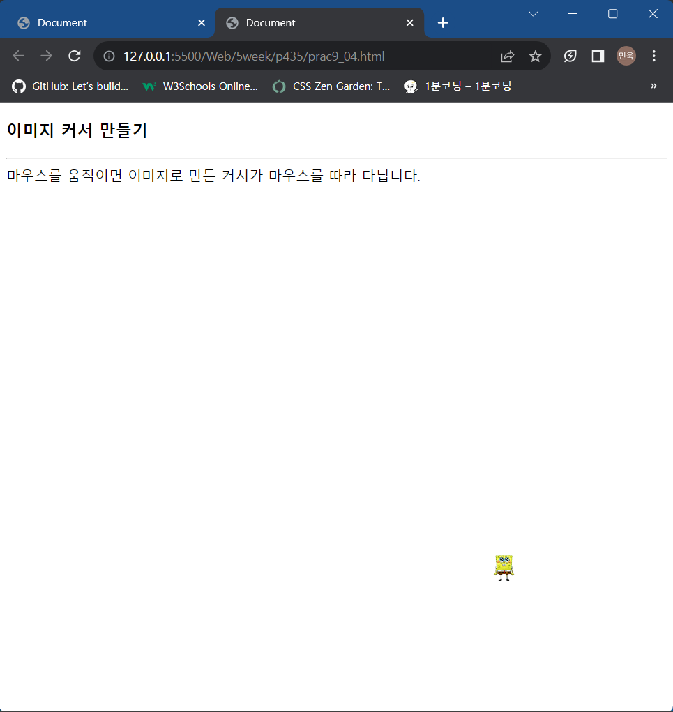
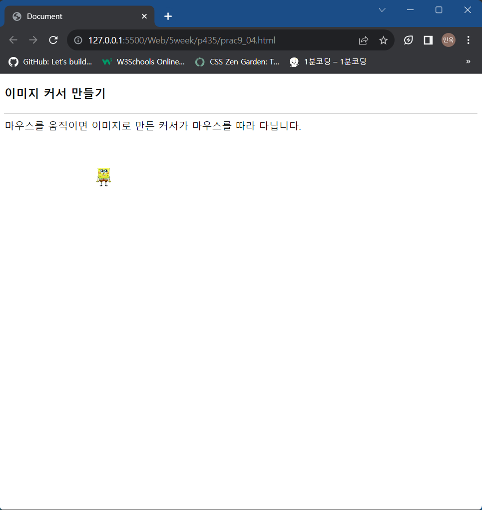
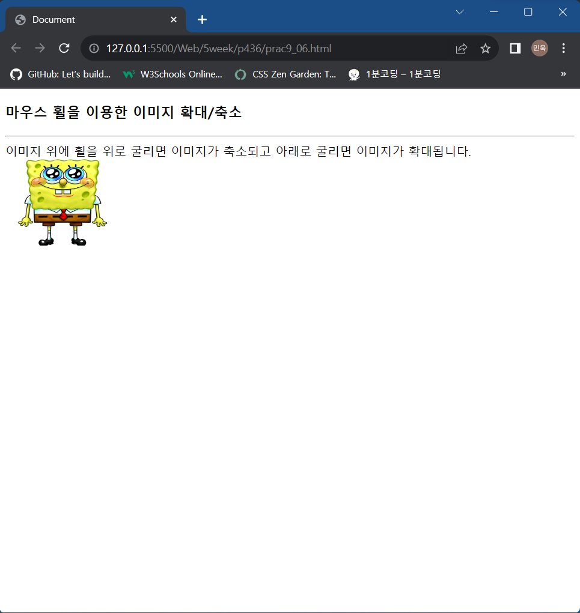

# 5week

# p379

## open_challenge_08.html


### code

```html
<!DOCTYPE html>
<head>
    <meta charset="UTF-8">
    <title>갬블링 게임</title>
    <style>
        table {
            border: 1px solid violet;
            border-collapse: collapse;
        }
        td {
            width: 50px;
            height: 50px;
            padding: 0px;
            font: italic 50px consolas, sans-serif;
            color: blue;
            text-align: center;
            background: linen;
        }
        div#msg {
            font: italic 18px consolas, sans-serif;
            color: magenta;
            margin-top: 10px;
        }
    </style>
    <script>
        var gameon = true;
        var gameArray = [0, 0, 0];

        function gen(e) {
            if(gameon == false) return;

            var n = Math.floor(Math.random()*3);
            var obj = e.target;
            obj.innerHTML = n;

            if(obj.id == "first") gameArray[0]=n;
            else if(obj.id == "second") gameArray[1]=n;
            else { 
                gameArray[2]=n;

                var result = document.getElementById("msg");

                if(gameArray[0] == gameArray[1] && gameArray[0] == gameArray[2]) {
                    result.innerHTML = "Success(click here to do again)";
                } else {
                    result.innerHTML = "fail(click here to do again)";
                }
            }
        }

        function reset() {
            gameArray = [0, 0, 0];

            document.getElementById("first").innerHTML=0;
            document.getElementById("second").innerHTML=0;
            document.getElementById("third").innerHTML=0;
            document.getElementById("msg").innerHTML="";

            gameon = true;
        }
    </script>
</head>
<body>
    <h3>갬블링 게임</h3>
    <p>각 숫자를 클릭하면 0에서 2사이의 난수로 바뀝니다.
        모두 같은 수가 나오면 승리합니다.
    </p>
    <hr>
    <table>
        <tr>
            <td id="first" onclick="gen(event)">0</td>
            <td id="second" onclick="gen(event)">0</td>
            <td id="third" onclick="gen(event)">0</td> 
        </tr>
    </table>
    <div id="msg" onclick="reset()"></div>
</body>
</html>
```

# p383

## prac8_01.html


### 클릭했을 경우


### code

```html
<!DOCTYPE html>
<head>
    <meta charset="UTF-8">
    <title></title>
</head>
<body>
    <h3>라면을 끓이는 순서</h3>
    <hr>
    <ol type="A" onclick="this.style.backgroundColor='yellowgreen';">
        <li>물을 끓인다.</li>
        <li>라면과 스프를 넣는다.</li>
        <li>파를 썰어 넣는다.</li>
        <li>5분 후 <strong>맛있게</strong> 먹는다.</li>
    </ol>
    <script>
        var a = document.getElementsByTagName("li");
        for(var i = 0; i<a.length; i++) {
            var b = a[i];
            b.style.color = "green";
        }
    </script>
</body>
</html>
```

# p385

## prac8_02(2).html


### 'border' 버튼을 눌렀을 경우


### code

```html
<!DOCTYPE html>
<head>
    <meta charset="UTF-8">
    <title>자바스크립트 연습</title>
    <script>
        function a() {
            var i = document.getElementById("mySpan");
            i.style.border = "2px dotted violet";
        }
    </script>
</head>
<body>
    <h3>자바스크립트란?
    <button onclick="a()">border</button>
    <button>p</button>
    </h3>
    <hr>
    <p>자바스크립트는 웹 프로그래밍 언어로서 웹 페이지를 동적 변경시킬 수 있다.</p>
    <p><span id="mySpan">c언어</span>를 아는 사용자는 빠르게 학습할 수 있다.</p>
    <p>이벤트 등 GUI프로그래밍에 필요한 요소들이 있어 학습에 약간의 어려움이 있다.</p>
</body>
</html>
```

## prac8_02(3).html


### code

```html
<!DOCTYPE html>
<head>
    <meta charset="UTF-8">
    <title>자바스크립트 연습</title>
    <script>
        function a() {
            var i = document.getElementsByTagName("p");
            alert("<p> 태그의 개수는 "+i.length);
        }
    </script>
</head>
<body>
    <h3>자바스크립트란?
    <button>border</button>
    <button onclick="a()">p</button>
    </h3>
    <hr>
    <p>자바스크립트는 웹 프로그래밍 언어로서 웹 페이지를 동적 변경시킬 수 있다.</p>
    <p><span id="mySpan">c언어</span>를 아는 사용자는 빠르게 학습할 수 있다.</p>
    <p>이벤트 등 GUI프로그래밍에 필요한 요소들이 있어 학습에 약간의 어려움이 있다.</p>
</body>
</html>
```

## prac8_03.html


### 'show/hide' 버튼을 눌렀을 경우


### code

```html
<!DOCTYPE html>
<head>
    <meta charset="UTF-8">
    <title>visibility 프로퍼티</title>
    <style>
        h3 {
            display: inline;
        }
        span {
            visibility: hidden;
        }
    </style>
    <script>
        let state = "hidden";
        function change() {
            if(state == "hidden") {
                state = "visible";
            } else {
                state = "hidden";
            }
            let spanArray = document.querySelectorAll("span")
            for(let span of spanArray) {
                span.style.visibility = state;
            }
        }
    </script>
</head>
<body>
    <h3>다음 빈 곳에 숨은 단어?</h3>
    <button type="button" onclick="change();">show/hide</button>
    <hr>
    <ul>
        <li>I (<span>love</span>) you</li>
        <li>CSS is Cascading (<span>style</span>) Sheet</li>
        <li>응답하라 (<span>1988</span>)</li>
    </ul>
</body>
</html>
```

# p386

## prac8_04.html


### '답'을 눌렀을 경우


### code

```html
<!DOCTYPE html>
<head>
    <meta charset="UTF-8">
    <title>계산해봅시다</title>
</head>
<body>
    <h3>계산해봅시다</h3>
    <hr>
    <p>2 + 4 = <span onclick="this.innerHTML = eval(2+4)">답</span></p>
    <p>4 * 20 + 64 = <span onclick="this.innerHTML = eval(4*20+64)">답</span></p>
    <p>20/5-8*2 = <span onclick="this.innerHTML = eval(20/5-8*2)">답</span></p>
</body>
</html>
```

## prac8_05.html


### 이미지를 클릭했을 경우


### code

```html
<!DOCTYPE html>
<head>
    <meta charset="UTF-8">
    <title>z-index 프로퍼티</title>
    <style>
        div {
            position: absolute;
        }
        img {
            position: absolute;
        }
    </style>
</head>
<body>
    <h3>z-index 스타일 프로퍼티</h3>
    <hr>
    <div>
        
        
        
        
    </div>
    <script>
        var imgArray = document.getElementsByTagName("img");
        for(i = 0; i < imgArray.length; ++i) {
            var img = imgArray[i];
            img.style.zIndex = i;
            img.style.left = "10px";
            img.style.top = "20px";
            img.onclick = shuffle;
        }
        function shuffle() {
            for(i = 0; i < imgArray.length; ++i) {
                var img = imgArray[i];
                img.style.zIndex++;
                img.style.zIndex %= imgArray.length;
            }
        }
    </script>
</body>
</html>
```

# p387

## prac8_06.html


### 텍스트를 클릭했을 경우


### code

```html
<!DOCTYPE html>
<head>
    <meta charset="UTF-8">
    <title></title>
    <script>
        function a() {
            let b = prompt("HTML 텍스트 혹은 그냥 텍스트를 입력하세요");
            let c = document.getElementById("tra")
            c.innerHTML = b
        }
    </script>
</head>
<body>
    <h3>innerHTML</h3>
    <hr>
    <p id="tra" onclick="a()">이번 여름에는 어디로 여행을 갈까요?</p>
</body>
</html>
```

# p388

## prac8_07(1).html


### 이미지를 클릭했을 경우


### code

```html
<!DOCTYPE html>
<head>
    <meta charset="UTF-8">
    <title></title>
</head>
<body>
    <h3>클릭하면 90도 회전합니다.</h3>
    <hr>
    
</body>
</html>
```

## prac8_07(2).html


누를때 마다 90도씩 회전

### code

```html
<!DOCTYPE html>
<head>
    <meta charset="UTF-8">
    <title></title>
    <script>
        var n = 90;
        function rotate(obj) {
            obj.style.transform = "rotate(" + n + "deg)";
            n += 90;
            n %= 360;
        }
    </script>
</head>
<body>
    <h3>클릭하면 90도 회전합니다.</h3>
    <hr>
    
</body>
</html>
```

## prac8_08.html


이미지를 누를수록 옆으로 계속 늘어남

### code

```html
<!DOCTYPE html>
<head>
    <meta charset="UTF-8">
    <title></title>
    <script>
        let n = 2;
        function change(obj) {
            obj.style.transform = "scale(" + n + ", 1)";
            n = n * 2;
        }
    </script>
</head>
<body>
    <h3>클릭하면 2, 3, 4배로 옆으로 늘어납니다.</h3>
    <hr>
    
</body>
</html>
```

## prac8_09.html


### 텍스트를 클릭했을 경우


입력한 텍스트가 리스트에 추가된다

### code

```html
<!DOCTYPE html>
<head>
    <meta charset="UTF-8">
    <title>라면을 끓이는 순서</title>
    <script>
        function addItem(parent) {
            let content = prompt("라면을 끓이는 순서를 입력하라.");
            let newLi = document.createElement("li");
            newLi.innerHTML = content;
            parent.appendChild(newLi);
        }
    </script>
</head>
<body>
    <h3>라면을 끓이는 순서</h3>
    <hr>
    <ol type="A" style="background-color: yellowgreen;" onclick="addItem(this)">
        <li>물을 끓인다.</li>
    </ol>
</body>
</html>
```

# p389

## prac8_10(1).html


### '답보기' 버튼을 클릭했을 경우


### code

```html
<!DOCTYPE html>
<head>
    <meta charset="UTF-8">
    <title>DOM 객체 동적 삽입</title>
    <script>
        function addAnswer(obj, text) {
            let newDiv = document.createElement("div");
            newDiv.innerHTML = text;
            obj.parentElement.appendChild(newDiv);

            newDiv.onclick(change(this));
        }
        function change(me) {
            me.parentElement.removeChild(me)
        }
    </script>
</head>
<body>
    <h3>정답의 동적 삽입</h3>
    <hr>
    <div>
        <p>Q. 거울아 거울아 세상에서 누가 제일 예쁘니?</p>
        <button onclick="addAnswer(this, '백설공주')">답보기</button>
    </div>
    <div>
        <p>Q. 죽느냐 사느냐 어떤 것이 문제인가?</p>
        <button onclick="addAnswer(this, '둘다')">답보기</button>
    </div>
</body>
</html>
```

## prac8_10(2).html


### '답보기' 버튼을 눌러 나온 텍스트를 누를 시


텍스트가 사라진다

### code

```html
<!DOCTYPE html>
<head>
    <meta charset="UTF-8">
    <title>DOM 객체 동적 삽입</title>
    <script>
        function addAnswer(obj, text) {
            let newDiv = document.createElement("div");
            newDiv.innerHTML = text;
            obj.parentElement.appendChild(newDiv);
            newDiv.addEventListener("click", 
                function () {
                    this.parentElement.removeChild(newDiv);
                }
            );
        }
    </script>
</head>
<body>
    <h3>정답의 동적 삽입</h3>
    <hr>
    <div>
        <p>Q. 거울아 거울아 세상에서 누가 제일 예쁘니?</p>
        <button onclick="addAnswer(this, '백설공주')">답보기</button>
    </div>
    <div>
        <p>Q. 죽느냐 사느냐 어떤 것이 문제인가?</p>
        <button onclick="addAnswer(this, '둘다')">답보기</button>
    </div>
</body>
</html>
```

# p430

## open_challenge_09.html


### 이미지를 클릭했을 경우


위치가 바뀐다

### code

```html
<!DOCTYPE html>
<head>
    <meta charset="UTF-8">
    <title>마우스 클릭 연습</title>
    <style>
        table {
            border: 1px solid blue;
            border-collapse: collapse;
        }
        td {
            border: 1px solid blue;
            width: 50px;
            height: 50px;
            padding: 0px;
        }
    </style>
    <script>
        var select = 0;
        var img = new Image();
        img.src="spongebob.png";

        function set() {
            var table = document.getElementById("table1");

            for(var i = 0; i < 10; i++) {
                var row = document.createElement("tr");

                for(var j = 0; j < 10; j++) {
                    var col = document.createElement("td");
                    col.innerHTML = ""
                    row.appendChild(col);
                }
                table.appendChild(row);
            }
            for(var i = 0; i < 100; i++) {
                document.images[i].onclick = moveImage;
            }
            moveImage();
        }

        function moveImage() {
            document.images[select].src = "";
            select = Math.floor(Math.random()*100);
            document.images[select].src = img.src;
        }
    </script>
</head>
<body onload="set()">
    <h3>마우스 클릭 연습</h3>
    <hr>
    <table id="table1"></table>
</body>
</html>
```

# p434

## prac9_01.html


### code

```html
<!DOCTYPE html>
<head>
    <meta charset="UTF-8">
    <title>Document</title>
    <script>
        window.onblur = function() {
            document.body.style.backgroundColor = "lightgray";
        }
        window.onfocus = function() {
            document.body.style.backgroundColor = "white";
        }
    </script>
</head>
<body>
    <h3>포커스와 onblur, onfocus</h3>
    <hr>
    <p>브라우저 바깥에 마우스를 클릭하면 window 객체에 
        blur 이벤트가 발생하고 다시 마우스를 클릭하면 
        window 객체에 focus 이벤트가 발생한다.
    </p>
</body>
</html>
```

## prac9_02.html


### code

```html
<!DOCTYPE html>
<head>
    <meta charset="UTF-8">
    <title>Document</title>
    <script>
        function change() {
            let found = null;
            let newForm = document.getElementsByName("fruit")
            let img = document.getElementById("fruitimage")
            for(let i = 0; i < newForm.length; i++) {
                if(newForm[i].checked == true) {
                    found = newForm[i];
                    break;
                }
            }
            img.src = found.value;
        }
    </script>
</head>
<body onload="change()">
    <h3>라디오 버튼을 클릭하면 이미지를 출력합니다.</h3>
    <hr>
    <form>
        <input type="radio" name="fruit" value="바나나.png" checked onchange="change()"> 바나나
        <input type="radio" name="fruit" value="망고.png" onchange="change()"> 망고
        <input type="radio" name="fruit" value="사과.png" onchange="change()"> 사과
    </form>
    
</body>
</html>
```

# p435

## prac9_03.html


### code

```html
<!DOCTYPE html>
<head>
    <meta charset="UTF-8">
    <title>Document</title>
    <script>
        function procKey(ev) {
            if(ev.keyCode == 13) {
                let exp = eval(document.querySelector("#exp").value)
                document.querySelector("#val").value = exp
            }
        }
    </script>
</head>
<body>
    <h3>계산기 만들기</h3>
    <hr>
    <p>수식을 입력하고 &lt;Enter&gt;를 입력하세요.</p>
    <form>
        식 <input type="text" id="exp" onkeypress="procKey(event)"> <br>
        값 <input type="text" id="val">
    </form>
</body>
</html>
```

## prac9_04.html





### code

<!DOCTYPE html>
<head>
    <meta charset="UTF-8">
    <title>Document</title>
    <style>
        #hey {
            display: inline;
            position: absolute;
            top: 15px;
            left: 25px;
        }
    </style>
    <script>
        function curse() {
            window.onmouseover = function(e) {
                let newDiv = document.getElementById("hey")
                newDiv.style.top = e.clientY+"px"
                newDiv.style.left = e.clientX+"px"
            }
        }
    </script>
</head>
<body onload="curse()">
    <h3>이미지 커서 만들기</h3>
    <hr>
    마우스를 움직이면 이미지로 만든 커서가 마우스를 따라 다닙니다.
    <div id=hey style="display: absolute;"></div>
</body>
</html>

## prac9_05.html


### code

```html
<!DOCTYPE html>
<head>
    <meta charset="UTF-8">
    <title>Document</title>
</head>
<script>
    window.ondblclick = function() {
        let r = Math.floor(Math.random()*256)
        let g = Math.floor(Math.random()*256)
        let b = Math.floor(Math.random()*256)
        document.body.style.backgroundColor = "rgb(" + r + "," + g + "," + b + ")"
    }
</script>
<body>
    <h3>바탕 아무 곳이나 더블 클릭</h3>
    <hr>
    <p>바탕 아무 곳이나 <strong>더블 클릭</strong>
    하면 바탕색이 랜덤하게 변합니다.</p>
</body>
</html>
```

# p436

## prac9_06.html




### code

```html
<!DOCTYPE html>
<head>
    <meta charset="UTF-8">
    <title>Document</title>
    <script>
        function wheel(e, img) {
            if(e.wheelDelta < 0) {
                img.width -= img.width*0.05
                img.height -= img.height*0.05
            } else {
                img.width += img.width*0.05
                img.height += img.height*0.05
            }
        }
    </script>
</head>
<body>
    <h3>마우스 휠을 이용한 이미지 확대/축소</h3>
    <hr>
    이미지 위에 휠을 위로 굴리면 이미지가 축소되고 아래로 굴리면 이미지가 확대됩니다.<br>
    
</body>
</html>
```

## prac9_07.html


### code

```html
<!DOCTYPE html>
<head>
    <meta charset="UTF-8">
    <title>이벤트 객체의 target</title>
    <script>
        window.onmouseover = function(e) {
            if(e.target.tagName == "SPAN") {
                e.target.style.textDecoration = "underline";   
            } 
        }
        window.onmouseout = function(e) {
            if(e.target.tagName == "SPAN") {
                e.target.style.textDecoration = "none";
            }
        }
    </script>
</head>
<body>
    <h3>span 태그에만 onmouseover / onmouseout</h3>
    <hr>
    <p>span 태그에 대해서만 <span>마우스</span>가 
    올라올 때 밑줄이 그어지고 <span>마우스</span>가 
    내려갈 때 밑줄이 사라지도록 <span>자바스크립트 코드를</span>를 
    작성한다.</p>
</body>
</html>
```

# p437

## prac9_08.html


### code

```html
<!DOCTYPE html>
<head>
    <meta charset="UTF-8">
    <title>이벤트 객체의 target</title>
    <script>
        let n = 1;
        function change(obj) {
            let newLi = document.getElementsByTagName("li")
            for(let i = 0; i < newLi.length; i++) {
                newLi[i].style.fontSize = "1em";
            }
            obj.style.fontSize = n+"em";
            n = n*1.3;
        }
    </script>
</head>
<body>
    <h3>아이템을 클릭하면 1.3배 크기로</h3>
    <hr>
    <p>여름 방학 때 하고 싶은 것들</p>
    <ul>
        <li onclick="change(this)">자전거로 대한민국 일주</li>
        <li onclick="change(this)">책 100권 읽기</li>
        <li onclick="change(this)">철인 3종 경기 준비</li>
        <li onclick="change(this)">자바스크립트 정복</li>
    </ul>
</body>
</html>
```

## prac9_09.html


### code

```html
<!DOCTYPE html>
<head>
    <meta charset="UTF-8">
    <title>Document</title>
    <script>
        function showExp(ev, msg) {
            let div = document.querySelector("#exp")
            div.innerHTML = msg;
            div.style.visibility = "visible"
            div.style.top = ev.clientY+"px"
            div.style.left = ev.clientX+"px"
        }
        function hideExp() {
            let div = document.querySelector("#exp")
            div.style.visibility = "hidden"
        }
    </script>
    <style>
        #exp {
            visibility: hidden;
            position: absolute;
            width: 200px;
            background-color: wheat;
        }
    </style>
</head>
<body>
    <h3>아이템에 마우스를 올리면 설명 출력</h3>
    <hr>
    <p>여름방학 때 하고 싶은 것들</p>
    <ul>
        <li onmouseover="showExp(event, '빨간 자전거를 타고 서울 찍고 부산 찍고 목포 인천으로')" onmouseout="hideExp();">
        자전거로 대한민국 일주</li>
        <li onmouseover="showExp(event, '열혈강호, 드래곤볼 빨간머리 앤 등을 읽기')" onmouseout="hideExp();">
        책 100권 읽기</li>
    </ul>
    <div id="exp"></div>
</body>
</html>
```

# p438

## prac9_10.html


### code

```html
<!DOCTYPE html>
<head>
    <meta charset="UTF-8">
    <title>계산기 만들기</title>
    <style>
        button {
            width: 80px;
        }
        td {
            width: 100px;
        }
        input {
            width: 400px;
        }
    </style>
    <script>
        function add(char) {
            let display = document.getElementById("display")
            display.value = display.value + char
        }
        function result() {
            let display = document.getElementById("display")
            let a = eval(display.value)
            document.getElementById("display").value = a
        }
        function CE() {
            let display = document.getElementById("display")
            document.getElementById("display").value = ""
        }
        function BACK() {
            let display = document.getElementById("display")
            display.value = display.value.substring(0, display.value.length-1);
        }
    </script>
</head>
<body>
    <h3>계산기 만들기</h3>
    <hr>
    <input type="text" placeholder="0" id="display">
    <table>
        <tr>
            <td><button type="button" onclick="BACK()">BACK</button></td>
            <td><button type="button" onclick="CE()">CE</button></td>
            <td><button type="button" onclick="CE()">C</button></td>
            <td><button type="button" onclick="result()">=</button></td>
        </tr>
        <tr>
            <td><button type="button" onclick="add(7)">7</button></td>
            <td><button type="button" onclick="add(8)">8</button></td>
            <td><button type="button" onclick="add(9)">9</button></td>
            <td><button type="button" onclick="add('/')">/</button></td>
        </tr>
        <tr>
            <td><button type="button" onclick="add(4)">4</button></td>
            <td><button type="button" onclick="add(5)">5</button></td>
            <td><button type="button" onclick="add(6)">6</button></td>
            <td><button type="button" onclick="add('*')">*</button></td>
        </tr>
        <tr>
            <td><button type="button" onclick="add(1)">1</button></td>
            <td><button type="button" onclick="add(2)">2</button></td>
            <td><button type="button" onclick="add(3)">3</button></td>
            <td><button type="button" onclick="add('-')">-</button></td>
        </tr>
        <tr>
            <td><button type="button" onclick="add(0)">0</button></td>
            <td><button type="button" onclick="add('+')">+</button></td>
            <td><button type="button">NONE</button></td>
            <td><button type="button">NONE</button></td>
        </tr>
    </table>
</body>
</html>
```